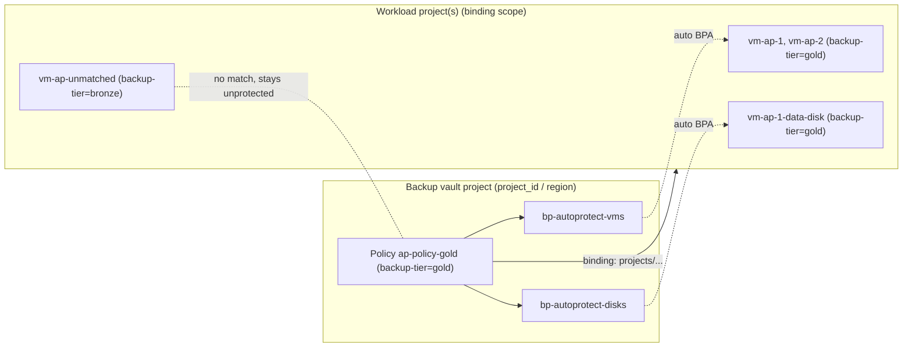

# Backup DR - Terraform Project

This Terraform project provisions a test environment for Google Cloud Backup and DR features, specifically focusing on **Cross-Project CMEK Backups**, **Split-Brain Restore Strategies**, **Label-driven Auto-Protection Policies** and **Cross-Region Backups**.

## What's New (October 2026 refresh)

| Feature | Status in Backup and DR | How this lab exercises it | Toggle |
|---|---|---|---|
| **Auto-protection policies** (label-based) | Preview (Sept 2026) | Policy + bindings via `gcloud beta`, labelled demo VMs/disk, negative control VM, verification script | `enable_auto_protection` |
| **Cross-region backups** | GA (June 2026) | Vault in `dr_region`, plan + BPA in `region` pointing at it, protects `vm-xr`, restore reads from the secondary-region vault | `enable_cross_region_backup` |
| **Application-consistent VM backups** (Guest Flush / VSS) | GA | `compute_instance_backup_plan_properties.guest_flush` on VM plans | `enable_guest_flush` |
| **Shielded VM restores** without org-policy changes | GA (April 2026) | `requireShieldedVm` override is now **off by default** | `override_shielded_vm_org_policy` |
| **Custom-retention on-demand backups** (Cloud SQL, AlloyDB) | GA (July 2026) | `max_custom_on_demand_retention_days` on the plans + `-d` flag in the trigger script | `max_custom_on_demand_retention_days` |
| **Cloud SQL log retention in vault** (PITR) | GA | `log_retention_days` on the SQL plan | `sql_log_retention_days` |
| **Vault access restriction** | GA | `access_restriction` on all vaults | `vault_access_restriction` |
| **CMEK for Compute Engine / PD backups** | **GA (March 2026)** – no allowlist needed | Existing cross-project CMEK vault | – |
| **Centralised backup project** (vaults/plans/policies protecting other projects) | GA | All vaults, plans and the auto-protection policy in `vault_project_id`; vault service agents get `backupdr.computeEngineOperator`/`diskOperator` on workload projects | `vault_project_id` |
| **Greenfield bootstrap** | – | Central KMS project, Terraform-built Shared VPC, `scripts/bootstrap_projects.sh` | `kms_project_id`, `create_shared_vpc` |

All new capabilities are **opt-in**; with default variables the plan is unchanged apart from the Shielded VM override (see [Shielded VM restores](#shielded-vm-restores)).

## Project Structure

The project follows standard Terraform modular practices:

- **`main.tf`**: Core compute, database, and storage resources (VMs, Cloud SQL, Filestore, AlloyDB).
- **`backup.tf`**: Backup infrastructure (Vaults, Plans, Associations) for all workloads.
- **`auto_protection.tf`**: Label-driven auto-protection policy, bindings, dedicated plans and demo workloads (Preview, managed with `gcloud beta`).
- **`cross_region.tf`**: Cross-region vault/plan, demo VM and restore from the secondary-region vault.
- **`restore.tf`**: Dedicated configuration for testing Compute Engine VM restore operations.
- **`restore_sql.tf`**: Native restore configurations for Cloud SQL.
- **`restore_filestore.tf`**: Native restore configurations for Filestore.
- **`restore_alloydb.tf`**: Native restore configurations for AlloyDB.
- **`apis.tf`**: API enablement and dependency management.
- **`projects.tf`**: Project-layout locals (vault/KMS project fallbacks) and API enablement for the backup/host/KMS projects.
- **`network_shared_vpc.tf`**: Optional Terraform-built Shared VPC (host enablement, service-project attachment, subnets, IAP firewall).
- **`iam_cross_project.tf`**: Vault service-agent operator roles on workload projects when vaults are centralised.
- **`kms_infra_prod.tf`**: CMEK Key infrastructure for the encrypted source project.
- **`kms_gcbdr.tf`**: KMS configuration for the Backup Vault project.
- **`network_dr.tf`**: Isolated VPC configuration for DR testing.
- **`scripts/`**: Helper scripts:
  - `bootstrap_projects.sh` – enables per-role APIs, creates Backup and DR service agents, prints blocking org policies (run before the first apply on new projects).
  - `get_latest_backup.sh` – dynamic recovery-point discovery used by the restore data sources.
  - `trigger_ondemand_backups.sh` – triggers on-demand backups for every BPA (incl. policy-created ones).
  - `verify_auto_protection.sh` – positive/negative assertions for the auto-protection lab.
  - `toggle_dependencies.py` – switches restores between concurrent and sequential mode.
  - `generate_report.py` – RTO dashboard (project IDs now read from the `lab_context` output).
- **`tests/`**: Offline `terraform test` suite using mock providers and a `gcloud` stub.

For comprehensive syntax examples and detailed instructions on how to build recovery plans via Terraform, see the [GCBDR Recovery Plans Guide](gcbdr_recovery_plans.md).

## Prerequisites

- **Terraform**: >= 1.5.0
- **Google Cloud SDK**: You must have `gcloud` installed and authenticated (`gcloud auth login`). The auto-protection feature additionally needs the **beta** component (`gcloud components install beta`).
- **jq**: Required by the helper scripts.
  > **Note**: The restore scripts use your local `gcloud` credentials to dynamically discover backups. ensure your session is active.
- **Google Cloud Projects**: You will need source, target (DR), and backup vault projects. For brand-new projects, run `./scripts/bootstrap_projects.sh` first (see [Centralised 4-Project Layout](#centralised-4-project-layout-greenfield)).
- **IAM (caller)**: Owner (or equivalent) on every lab project; `roles/compute.xpnAdmin` at org/folder level when `create_shared_vpc = true`.

> [!NOTE]
> **CMEK Support**: Backup vault support for CMEK-encrypted Compute Engine instances and Persistent Disks became **generally available in March 2026**; Cloud SQL (June 2026), AlloyDB (Sept 2026) and Filestore (Aug 2026) followed. No allowlisting is required any more.

## Configuration

This project avoids hardcoding environment-specific values. 

1.  **Copy the example variables file:**
    ```bash
    cp terraform.tfvars.example terraform.tfvars
    ```
2.  **Edit `terraform.tfvars`** with your specific project IDs, regions, and network names.
    *   `project_id`: Source Project ID
    *   `dr_project_id`: Target/DR Project ID
    *   `gcbdr_project_id`: Backup Vault Project ID
    *   `infra_prod_project_id`: CMEK Source Project ID
    *   Optional (centralised layout): `vault_project_id` (all vaults/plans/policies), `kms_project_id` (all key rings), `create_shared_vpc` + `subnet_cidr` / `dr_subnet_cidr` (Terraform builds the Shared VPC in `host_project_id`).
3.  **New projects only** – enable APIs and create the Backup and DR service agents, and review the org-policy report:
    ```bash
    ./scripts/bootstrap_projects.sh -n && ./scripts/bootstrap_projects.sh
    ```

## Core Concepts

### Cross-Project CMEK Strategy
To support CMEK-encrypted backups, we implement a **Cross-Project Vault Architecture**:
1.  **Source**: CMEK-encrypted VMs reside in the CMEK Source Project (`infra_prod_project_id`).
2.  **Vault**: Backups are stored in a separate project (`gcbdr_project_id`) using a CMEK-enabled Backup Vault.
3.  **Key Management**: Both projects utilize specific Service Agents with bidirectional IAM permissions to allow encryption/decryption across project boundaries.

### Split-Brain Restore Strategy
During a Disaster Recovery (DR) Test, we employ a "Split-Brain" approach to handle different workload requirements:

1.  **Standard Workloads**:
    - Restored to **DR Project** (`dr_project_id`).
    - Can target Shared VPC or Isolated VPC.
2.  **CMEK Encrypted Workloads**:
    - Restored to **Source Project** (`infra_prod_project_id`) in the **Source Region** (In-Place Restore).
    - **Reason**: Cloud Key Management Service (KMS) keys are regional. To verify the restore without complex re-keying or cross-region key creation, we restore strictly to the source location using the original Source Key.

## Usage

### 1. Initialize
```bash
terraform init
```

### 2. Provision Resources (Backup Phase)
> [!IMPORTANT]
> **Do not begin with `perform_dr_test=true`**. The infrastructure, backup vault, and backup images do not exist yet! You must provision the baseline infrastructure first and wait for the initial backups to complete before executing a restore test.

Apply the base configuration to create VMs, enable APIs, and configure Backup Plans.
```bash
terraform apply \
  -var="perform_dr_test=false" \
  -var="provision_cloud_sql=true" \
  -var="create_isolated_dr_vpc=true" \
  -var="restore_suffix=-dr"
```
*Note: Includes wait timers (approx. 2-3 mins) for API enablement and IAM propagation.*

### 3. Perform DR Test (Restore Phase)
> [!NOTE]
> The Terraform configurations define scheduled backup windows (e.g., `12:00 - 24:00 UTC`). To test restores immediately, trigger on-demand backups for every backup plan association in the source, CMEK and auto-protection scope projects:
> ```bash
> ./scripts/trigger_ondemand_backups.sh          # add -n for a dry run, -m vm-ap to filter, -d 7 for custom retention
> ```

> [!IMPORTANT]
> **CRITICAL REQUIREMENT: Run Restore Testing TWICE on First Attempt**
> When setting `perform_dr_test=true` for the first time in a new environment, Terraform must execute a **Two-Phase Apply Lifecycle**:
> - **1st Pass**: Plans and binds the necessary cross-project IAM roles (`roles/backupdr.restoreUser` and `roles/alloydb.admin`). Because data sources run during the *Plan* phase before these roles exist, dynamic backup discovery gracefully falls back to `"dummy"`. Workloads will report "No changes".
> - **TIMING DELAY**: Google Cloud IAM cross-project replication can take up to **5 minutes** to fully propagate new role bindings across regional endpoints. **Please pause for ~5 minutes after completing Pass 1**.
> - **2nd Pass**: Re-running the apply authenticates successfully with the newly propagated IAM roles, locates the real recovery point IDs, and actively triggers workload restoration.
> 
> **Always run `./run_restore.sh` twice (with a ~5 min pause)** when activating DR testing!
>
> `./run_restore.sh` adds `-var=perform_dr_test=true` automatically (so `terraform.tfvars` can keep `perform_dr_test = false` for the backup phase) and **skips the DR report when no workloads were restored** — i.e. on pass 1 it prints `[PASS 1 COMPLETE]` and tells you to re-run. The report is generated on pass 2 from real Terraform state; the illustrative sample report is only rendered with `DR_REPORT_DEMO=1 python3 scripts/generate_report.py <start_epoch>`.

Once the baseline infrastructure is deployed, **the initial backups have successfully completed**, and cross-project IAM privileges are bound, you can trigger the restore process using the provided wrapper script:

```bash
./run_restore.sh
```

#### Optimizing Restore Concurrency (Concurrent vs. Sequential Restore)
By default, this project supports two recovery execution modes:

1. **Concurrent Restore (Parallel Mode - Default)**: Decouples all resource dependencies so that all VM, disk, database, and Filestore restores start provisioning simultaneously at T-0. This provides the fastest possible recovery path for rapid testing.
2. **Sequential Phase-Based Restore**: Enforces dependency gates between workloads (e.g. AlloyDB completes -> Cloud SQL/Filestore completes -> VMs restore and mount).

##### How to Toggle Concurrency Modes
Because the Terraform Directed Acyclic Graph (DAG) is constructed statically during planning, we cannot toggle DAG execution paths dynamically using variable logic. To switch modes, we use the provided toggle script to modify HCL comments on disk prior to running the apply:

```bash
# Switch HCL to Concurrent Restore (Parallel Mode)
python3 scripts/toggle_dependencies.py parallel

# Switch HCL to Sequential Phase-Based Restore
python3 scripts/toggle_dependencies.py sequential
```

Once the mode is selected, run the recovery:
```bash
./run_restore.sh
```

*Note: The restore script automatically increases CLI parallelism (`-parallelism=30`) to prevent Terraform API call queuing.*

## Auto-Protection Policies (Preview)

Auto-protection removes the need for one `google_backup_dr_backup_plan_association` per workload: a policy in the backup vault project assigns backup plans to every Compute Engine instance/disk in the bound workload projects that carries a matching label.



### How it is implemented
* The Google provider (checked up to `google` 8.6.0) has **no auto-protection resource yet**, so `auto_protection.tf` drives `gcloud beta backup-dr auto-protection-policies|auto-protection-bindings` from `terraform_data` with create (idempotent create-or-update) and destroy provisioners. Bindings are destroyed before the policy.
* Dedicated plans (`bp-autoprotect-vms`, `bp-autoprotect-disks`) are attached to the existing source vault, so `get_latest_backup.sh` and the restore drill pick up auto-protected VMs automatically (`restore_auto_protected_vms`).
* For scope projects other than `project_id`, the vault service agent is granted `roles/backupdr.computeEngineOperator` and `roles/backupdr.diskOperator`.


> [!IMPORTANT]
> The API allows **one backup plan (resource type) per policy** (`Only one BackupPlanDetail is allowed`). The lab therefore creates two policies sharing the same label key – `<auto_protection_policy_id>-vms` → `bp-autoprotect-vms` and `<auto_protection_policy_id>-disks` → `bp-autoprotect-disks` – each bound to every scope project.

### Run it
```bash
terraform apply -var="perform_dr_test=false" -var="enable_auto_protection=true"

# Matching + association typically takes up to 2h (worst case 8h)
./scripts/verify_auto_protection.sh                 # one-shot; exit 2 = still pending
WAIT_MINUTES=180 ./scripts/verify_auto_protection.sh # poll until matched

# Optional: back up the newly protected VMs now, then include them in the DR drill
./scripts/trigger_ondemand_backups.sh -m vm-ap
./run_restore.sh
```

The verification script asserts:
1. Policy, bindings and binding-matching resources are visible from the vault project.
2. The applied policy is visible from each workload project.
3. **Positive**: `vm-ap-*` and `vm-ap-1-data-disk` have backup plan associations (created by the policy, not Terraform).
4. **Negative**: `vm-ap-unmatched` (same key, value `bronze`) has **no** association – exit code 1 if it does.

> [!IMPORTANT]
> **Preview limitations**: Compute Engine instances and disks only; one region per policy; **every policy applied to a workload project must use the same label key** (e.g. `backup-tier=gold` and `backup-tier=silver` are fine, `backup-tier=gold` and `env=prod` are not). Removing a binding/policy un-protects resources asynchronously (up to 2–8h).

> [!TIP]
> To protect your own resources, set `auto_protection_demo_vm_count = 0` and label them: `gcloud compute instances add-labels <vm> --labels=backup-tier=gold --zone=<zone>`. Avoid labelling resources that already have a Terraform-managed association (e.g. `vm-debian`).

## Centralised 4-Project Layout (greenfield)

For brand-new projects (e.g. Argolis) the lab can build everything itself and keep **all backup control-plane objects in one backup project**:

| Role | Variable(s) | Example | Contains |
|---|---|---|---|
| Backup project | `vault_project_id`, `gcbdr_project_id` | `argo-svc-dev-6` | `bv-*` vaults (standard, CMEK, cross-region), all `bp-*` plans, `ap-policy-gold` |
| Workloads | `project_id`, `infra_prod_project_id` | `argo-svc-dev-7` | VMs, disks, CMEK Rocky VM, **BPAs** (BPAs always live with the resource) |
| DR / isolated recovery | `dr_project_id` | `argo-svc-dev-8` | `isolated-dr-vpc`, restored VMs/disks |
| Shared VPC host + KMS | `host_project_id`, `kms_project_id` | `argo-svc-dev-9` | `vpc_name` + source/DR subnets, all `kr-*` key rings |

```bash
./scripts/bootstrap_projects.sh -n   # dry run: APIs per project + org-policy report
./scripts/bootstrap_projects.sh      # enable APIs, create Backup and DR service agents
terraform init && terraform apply -var perform_dr_test=false
```

Key behaviours:
* `google_backup_dr_restore_workload` has no `project` argument, so restores from the standard / cross-region vault use the `google-beta.vault` provider alias (project = `vault_project_id`).
* When the vault project differs from `project_id`, the vault service agents get `roles/backupdr.computeEngineOperator` + `roles/backupdr.diskOperator` on the workload project before any BPA is created (60 s IAM propagation wait).
* The isolated DR VPC's Private Services Access peering is only created when a managed database is provisioned — `constraints/compute.restrictVpcPeering` in locked-down orgs would otherwise fail a Compute-only lab.
* Defaults (`vault_project_id = ""`, `kms_project_id = ""`, `create_shared_vpc = false`) preserve the original layout.

## Validation Log

| Date | Layout | Result |
|---|---|---|
| 2026-10-07 | 4-project centralised (`argo-svc-dev-6` backup, `-7` workloads, `-8` DR, `-9` Shared VPC + KMS), asia-southeast1 → asia-southeast2 | Greenfield bootstrap + base apply clean (no drift); 9/9 BPAs `ACTIVE` incl. 3 policy-created; `verify_auto_protection.sh` **PASS** (positive + negative) – policy matching took ~3 min, not the documented 2–8 h; cross-project vault IAM, cross-project CMEK (keys in `-9`) and cross-region plan all working |

Issues found during validation and fixed in code: one backup plan per auto-protection policy; cross-region plan must be in the workload region (only the vault is remote); `debian-cloud/debian-11` image family retired (now `debian-12`).

## Cross-Region Backups

`enable_cross_region_backup = true` creates a vault (`bv-xr-<dr_region>-<suffix>`) in the DR region and a plan (`bp-vms-xr-<dr_region>`) in the **workload** region whose `backup_vault` is that remote vault, then protects `vm-xr` (running in `region`) with it. Plan and association must share a region — only the vault is remote. During `./run_restore.sh` the `restore_vm_xr` workload restores **from the secondary-region vault**, which is the realistic pattern for a source-region outage (the regular `restore_vms` path still reads from the source-region vault).

* Supported workloads: Compute Engine instances/disks, Filestore, AlloyDB (Cloud SQL uses multi-region vaults instead).
* CMEK for a cross-region vault must come from the vault's region.
* Inter-region transfer charges apply.

## Shielded VM Restores

Backup and DR restores support Shielded VMs natively since April 2026, so `constraints/compute.requireShieldedVm` no longer needs to be relaxed on the DR project. The legacy override (`google_project_organization_policy.disable_shielded_vm_check`) is now gated by `override_shielded_vm_org_policy` (default **false**). On existing deployments the next apply removes the override, restoring the inherited policy. Restored VMs still enforce Secure Boot, vTPM and Integrity Monitoring.

## Offline Tests

The `tests/` directory contains a `terraform test` suite that uses mock providers, so it runs without GCP credentials. A `gcloud` stub on `PATH` captures the auto-protection commands instead of calling the API:

```bash
terraform init -backend=false
PATH="$PWD/tests/stub:$PATH" terraform test
cat /tmp/gcloud_stub.log   # inspect the generated gcloud beta commands
```

## Automated DR Drill Verification Dashboard

This project includes an automated compliance reporting framework that compiles a high-fidelity visual dashboard after each restoration run.

### 1. How it works
The `./run_restore.sh` wrapper script captures the exact T-0 start epoch of the restore. Upon successful completion of the Terraform apply phase, it automatically executes the Python report builder:
- **Dynamic State Discovery**: The compiler parses `terraform.tfstate` (or its backup copy) to automatically locate all restored resources across all five resource categories (VMs, Disks, Cloud SQL, Filestore, and AlloyDB).
- **Physical Throughput Metrics**: Calculates data provisioning transfer speeds in **MB/s** and **Gbps** for each restored storage volume.
- **RTO Gantt Chart**: Plots a dynamic horizontal visual timeline mapping disk provisioning vs. guest OS boot phases (telemetry logs are captured for VMs, and managed services are marked as active immediately upon provisioning).
- **Singapore-to-Jakarta Mapping**: Visualizes the Singapore (`asia-southeast1`) source to Jakarta (`asia-southeast2`) cross-region recovery flow.
- **Portable project context**: Project IDs and regions are read from the `lab_context` Terraform output (falling back to `terraform.tfvars`), so the report works in any environment. Auto-protected (`vm-ap-*`) and cross-region (`vm-xr`) restores are included automatically.

### 2. Output files
- **Latest symlink**: A copy is saved at **`dr_test_report.html`** in the root directory. You can open this file directly in any browser to view the latest drill results.
- **Audit History**: A timestamped backup is saved as `dr_report_YYYYMMDD_HHMMSS.html` to preserve historic compliance logs for security auditors.
- **Git Safety**: Generated HTML reports are automatically excluded from version control in `.gitignore`.

## Cleanup

### Destroy Restored Workloads Only
Re-apply with restores disabled (`terraform.tfvars` normally already has `perform_dr_test = false`, so a plain `terraform apply` does the same). `google_backup_dr_restore_workload` defaults to `delete_restored_instance = true`, so this **deletes the live restored VMs/disks** in the DR (and in-place CMEK) targets, not just the state entries. Backups and the base lab are untouched, ready for the next drill.

```bash
terraform apply -var="perform_dr_test=false"
```

> [!NOTE]
> An **instance** restore recreates every disk that was attached to the source VM (e.g. `vm-debian-dr-1`), but the API only applies `auto_delete` to the boot disk. `terraform_data.restored_vm_disk_autodelete` therefore marks those `<restored-vm>-<n>` data disks auto-delete right after each restore, so removing the restore no longer orphans them. Disks restored on their own (`vm-*-data-disk-dr`) are separate resources and are deleted by their own `restore_disk` / `restore_rocky_disk` entries. Check for strays with:
> `gcloud compute disks list --project=<dr_project_id> --filter="-users:*"`

### Destroy the Entire Lab
Backup vaults holding backups inside their enforced-retention window cannot be deleted, so take them out of Terraform first, destroy everything else, and delete the vaults once their backups have expired.

```bash
# 1. Restored workloads (as above)
terraform apply -var="perform_dr_test=false"

# 2. Record vault names, then hand the vaults over to manual cleanup
terraform output -json | jq -r '.backup_vault_id.value, .backup_vault_cmek_id.value, (.cross_region_backup.value.vault // empty)' | tee vaults_to_delete.txt
terraform state rm google_backup_dr_backup_vault.vault google_backup_dr_backup_vault.vault_cmek 'google_backup_dr_backup_vault.vault_xr[0]'

# 3. Destroy everything else (VMs, plans, BPAs, auto-protection policies, Shared VPC, DR VPC, KMS keys, IAM)
#    Auto-protection teardown blocks in scripts/ap_destroy.sh: binding unbind (async,
#    DELETION_INITIATED) -> policy delete -> wait until no policy-managed BPA references
#    bp-autoprotect-*. Default timeout per step 3600s (AP_DESTROY_TIMEOUT_SECONDS).
terraform destroy

# 3b. If 3 times out, just re-run it later (the helper is idempotent). Policy-managed
#     BPAs CANNOT be deleted directly ("managed by the AutoProtection system"). Watch:
VAULT_PROJECT=<vault_project_id>; WORKLOAD_PROJECT=<project_id>; REGION=<region>
for p in vms disks; do
  gcloud beta backup-dr auto-protection-bindings list --auto-protection-policy=ap-policy-gold-$p \
    --project=$VAULT_PROJECT --location=$REGION --format="value(name.basename(),state)"
done
gcloud backup-dr backup-plan-associations list --project=$WORKLOAD_PROJECT --location=$REGION \
  --filter="backupPlan~bp-autoprotect" --format="value(name.basename(),state)"
AP_DESTROY_TIMEOUT_SECONDS=7200 terraform destroy

# 4. After the backups expire (rule retention = 3 days; vault minimum enforced retention = 1 day)
while read -r v; do
  gcloud backup-dr backup-vaults delete "$v" --ignore-inactive-datasources --ignore-backup-plan-references --quiet
done < vaults_to_delete.txt
```

Notes: key rings cannot be deleted in Cloud KMS (Terraform only forgets them; key versions are scheduled for destruction). APIs stay enabled (`disable_on_destroy = false`). Delete the vaults before **1 Nov 2026** or the vault project will also carry a Backup and DR lien (see caveat 6).

> [!WARNING]
> **Full Destroy Caveats**: If you run `terraform destroy` on the entire project, you may encounter errors:
> 1.  **Backup Vaults & KMS Keys**: These resources are soft-deleted by Google Cloud and cannot be fully purged immediately. To ensure you can repeatedly run `terraform apply` and `terraform destroy` without hitting "AlreadyExists" collisions, this codebase dynamically appends a 4-byte `random_id` suffix to your Vaults and KMS Key Rings.
> 2.  **Backup Vault Backups**: Vaults cannot be fully destroyed if they contain backups (`NON_EMPTY_BACKUP_VAULT_DELETION`). You must manually delete the backups from the GCBDR Console first or accept that the soft-deleted Vaults persist.
> 3.  **Backup Plans**: May fail if Associations are not largely deleted first (`BACKUP_PLAN_ASSOCIATIONS_EXIST`). Re-running destroy usually fixes this.
> 4.  **Service Networking**: May fail to release the IP range if Cloud SQL instances were just deleted (`Error code 9`). This typically resolves itself after a few minutes.
> 5.  **Auto-protection**: Teardown is strictly ordered and asynchronous: a binding delete only moves it to `DELETION_INITIATED`; the policy delete fails with `POLICY_IN_USE_BY_BINDING` until the binding is gone; policy-managed BPAs cannot be deleted directly and block `bp-autoprotect-*` plan deletion (`BACKUP_PLAN_ASSOCIATIONS_EXIST`). [ap_destroy.sh](scripts/ap_destroy.sh) waits through each stage; if it times out, re-run destroy later.
> 6.  **Project liens (from 1 Nov 2026)**: Backup and DR automatically places a lien on any project containing a backup vault with enforced-retention backups. Terraform resource destroys are unaffected, but **deleting the lab projects** requires removing the lien first (optionally gated by Privileged Access Manager multi-party approval).

## Known Limitations

### Cloud SQL Restore Implementation
> [!NOTE]
> Unlike Compute Engine restores which use the `google_backup_dr_restore_workload` resource, Cloud SQL restores use the standard **`google_sql_database_instance`** resource (Cloud SQL Module).
>
> The restore is triggered by passing the GCBDR Backup ID to the `backupdr_backup` argument within the `google_sql_database_instance` block. This approach is fully supported and confirmed working.


### Shielded VM Policy Violation
If you still see `Error 412: Constraint constraints/compute.requireShieldedVm violated` (recovery points taken before native Shielded VM restore support may lack Shielded metadata):
*   **Solution**: Set `override_shielded_vm_org_policy = true`. This disables the policy on the DR project via `google_project_organization_policy` and the `restore_workload` block still strictly enforces Shielded features on the restored VM ("Override + Enforce").

### Features not yet automatable in Terraform
*   **Auto-protection policies**: no provider resource yet – wrapped with `gcloud beta` (see above).
*   **Selective disk backup** (`boot-disk-only`, `disk-exclusion-labels`, July 2026): only available via console/gcloud (`gcloud backup-dr backup-plans create ... --compute-instance-properties=boot-disk-only=true`); not exposed by the provider as of `google` 8.6.0.
*   **Default backup plan**: applied at instance-creation time in the console; not modelled here.
